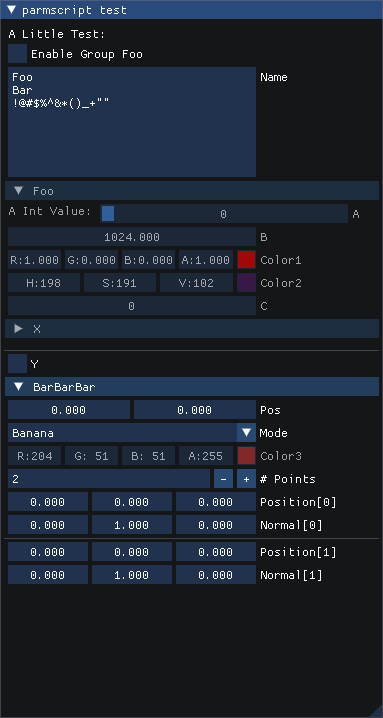

# Parm Script

With [dear ImGui](https://github.com/ocornut/imgui), it's quite easy to write one's own inspector already, but keeping the UI up-to-date with its underlaying data structure, tweaking their UI details ... still require some labor.

To solve that, one approach is to use reflection information, given a structure, generate UI for each of its fields. Unreal, Unity works this way.

Another approach is to define the interface first, then use that information to generate the underlying data structure - Houdini (can) work this way.

I think the second approach hasn't gotten enough attention as it deserves yet, translating UI description to data structure has some great advantages:

* The definition of parameter interface is not always identical to reflection information, e.g., separators/spacers/labels/groups are UI-only concepts that can make users happier, but are hard to represent in structs and metadata.
* It's easier to transpile to other forms, like raw C++ structure + inspect function, or Unreal UStructs with lots of metadata but no inspector.
* It's also possible to interpret the UI on the fly, without having to have a solid structure beforehand, so that end users can make their custom parameters (like in Houdini)

This project was my proof of concept experiment, but it works so well that I think it already has some real world value, so I released it here.

## A taste of Parm Script

// In fact, it's just Lua
<a id="example-script"></a>

```lua
parmset 'Hello'

label 'A Little Test:'
toggle 'x' {label='Enable Group Foo', default=true}
text 'name' {label='Name', default='Foo\nBar\n!@#$%^&*()_+""', multiline=true}
group 'foo' {label='Foo', disablewhen='{x}==false'}
  label 'A Int Value:' {joinnext=true}
  int 'a' {max=1024, min=1}
  float 'b' {default=1024, ui='drag', speed=1}
  color 'color1' {hdr=true, default={1,0,0}}
  color 'color2' {alpha=false, hsv=true, wheel=true, default={0.3,0.1,0.4,0.5}}
  int 'c'
  struct 'X'
    float 'a'
    float 'b'
    double 'c'
  endstruct 'X'
endgroup 'foo'
spacer ''
spacer ''
separator ''
toggle 'y'
group 'bar' {closed=true, label='BarBarBar'}
  float2 'pos' {disablewhen='{Points}.empty()'}
  menu 'mode' {
    class='Mode', label='Mode',
    items={'a','b','c'}, default='b',
    itemlabels={'Apple','Banana','Coffe'},
    itemvalues={4,8,16} }
  color 'color3' {default={0.8,0.2,0.2,1.0}, disablewhen='{mode}!={class:mode}::a'}
endgroup 'bar'
list 'Points' {class='Point'}
  float3 "pos" {label="Position"}
  float3 "N" {label="Normal", default={0,1,0}}
endlist 'Points'
```

## The Generator

To generate code from above script, you can call parmbaker from CLI:

```
$ lua parmbaker.lua tests/hello.lua
```

or from Lua you can call `cppStruct()` and `imguiInspector()` function:

```lua
local pe=require('parmexpr')
local ps=pe(--[[the script here]])
ps.setUseBuiltinTypes() -- use float[4] to represent float4, and so forth
-- you can also call ps.typedef('float4', 'Vector4f') or alike if you want
print('//----------CPP STRUCT-----------')
print(ps.cppStruct())
print('//----------IMGUI INSPECTOR----------')
print(ps.imguiInspector('parms'))
```

## C++ Compiled

Generated C++ structure:

```cpp
struct Hello {
  bool x = true; // ui="toggle", label="Enable Group Foo"
  std::string name = "Foo\nBar\n!@#$%^&*()_+\"\""; // ui="text", multiline=true, label="Name"
  int a; // min=1, max=1024
  float b = 1024; // ui="drag", speed=1
  float color1[4] = {1.0f, 0.0f, 0.0f, 1.0f}; // hdr=true
  float color2[4] = {0.3f, 0.1f, 0.4f, 0.5f}; // alpha=false, wheel=true, hsv=true
  int c;
  struct struct_X { // struct
    float a;
    float b;
    double c;
  };
  struct_X X; // label="X"
  bool y; // ui="toggle"
  float pos[2]; // disablewhen="{Points}.empty()"
  enum class Mode {
    a=4, // label=Apple
    b=8, // label=Banana
    c=16, // label=Coffe
  };
  Mode mode = Mode::b; // ui="menu", class="Mode", label="Mode"
  float color3[4] = {0.8f, 0.2f, 0.2f, 1.0f}; // disablewhen="{mode}!={class:mode}::a"
  struct Point { // list
    float pos[3]; // label="Position"
    float N[3] = {0.0f, 1.0f, 0.0f}; // label="Normal"
  };
  std::vector<Point> Points; // class="Point"
};
```

Generated ImGui inspector:

```cpp
bool ImGuiInspect(Hello &parms, std::unordered_set<std::string>& modified) {
  modified.clear();
  ImGui::TextUnformatted("A Little Test:");
  if(ImGui::Checkbox("Enable Group Foo##x", &(parms.x))) modified.insert("x");
  if(ImGui::InputTextMultiline("Name##name", &(parms.name)))
    modified.insert("name");
  ImGui::BeginDisabled(parms.x==false);
  if(ImGui::CollapsingHeader("Foo##foo", ImGuiTreeNodeFlags_DefaultOpen)) {
    ImGui::TextUnformatted("A Int Value:");
    ImGui::SameLine();
    if(ImGui::SliderInt("A##a", (&(parms.a)), 1, 1024))
      modified.insert("a");
    if(ImGui::DragFloat("B##b", (&(parms.b)), 1.000000f))
      modified.insert("b");
    if(ImGui::ColorEdit4("Color1##color1", (parms.color1), ImGuiColorEditFlags_AlphaBar | ImGuiColorEditFlags_AlphaPreview | ImGuiColorEditFlags_AlphaPreviewHalf | ImGuiColorEditFlags_HDR | ImGuiColorEditFlags_DisplayRGB | ImGuiColorEditFlags_Float))
      modified.insert("color1");
    if(ImGui::ColorEdit3("Color2##color2", (parms.color2), ImGuiColorEditFlags_NoAlpha | ImGuiColorEditFlags_DisplayHSV | ImGuiColorEditFlags_Uint8 | ImGuiColorEditFlags_PickerHueWheel))
      modified.insert("color2");
    if(ImGui::DragInt("C##c", (&(parms.c)), 1.000000f))
      modified.insert("c");
    if(ImGui::TreeNodeEx("X##X", ImGuiTreeNodeFlags_Framed)) {
      if(ImGui::DragFloat("A##a", (&(parms.X.a)), 1.000000f))
        modified.insert("X/a");
      if(ImGui::DragFloat("B##b", (&(parms.X.b)), 1.000000f))
        modified.insert("X/b");
      if(ImGui::InputDouble("C##c", &(parms.X.c)))
        modified.insert("X/c");
      ImGui::TreePop();
    }
  }
  ImGui::EndDisabled();
  ImGui::Spacing();
  ImGui::Spacing();
  ImGui::Separator();
  if(ImGui::Checkbox("Y##y", &(parms.y))) modified.insert("y");
  if(ImGui::CollapsingHeader("BarBarBar##bar", 0)) {
    ImGui::BeginDisabled(parms.Points.empty());
    if(ImGui::DragFloat2("Pos##pos", (parms.pos), 1.000000f))
      modified.insert("pos");
    ImGui::EndDisabled();
    static const char* mode_labels[]={"Apple", "Banana", "Coffe"};
    static const Hello::Mode mode_values[]={Hello::Mode::a, Hello::Mode::b, Hello::Mode::c};
    int current_item_mode = 0;
    for(; current_item_mode < 3; ++current_item_mode)
      if (mode_values[current_item_mode]==(parms.mode)) break;
    if (ImGui::Combo("Mode##mode", &current_item_mode, mode_labels, 3)) {
      parms.mode = mode_values[current_item_mode];
      modified.insert("mode");
    }
    ImGui::BeginDisabled(parms.mode!=Hello::Mode::a);
    if(ImGui::ColorEdit4("Color3##color3", (parms.color3), ImGuiColorEditFlags_AlphaBar | ImGuiColorEditFlags_AlphaPreview | ImGuiColorEditFlags_AlphaPreviewHalf | ImGuiColorEditFlags_DisplayRGB | ImGuiColorEditFlags_Uint8))
      modified.insert("color3");
    ImGui::EndDisabled();
  }
  int listPoints_cnt=static_cast<int>((parms.Points).size());
  if (ImGui::InputInt("# " "Points##Points", &listPoints_cnt)) {
    parms.Points.resize(listPoints_cnt);
    modified.insert("Points");
  }
  for(int listPoints_idx=0; listPoints_idx<listPoints_cnt; ++listPoints_idx) {
    std::string label_with_id_pos = "Position""["+std::to_string(listPoints_idx)+"]##pos";
    if(ImGui::DragFloat3(label_with_id_pos.c_str(), (parms.Points[listPoints_idx].pos), 1.000000f))
      modified.insert("Points/pos");
    std::string label_with_id_N = "Normal""["+std::to_string(listPoints_idx)+"]##N";
    if(ImGui::DragFloat3(label_with_id_N.c_str(), (parms.Points[listPoints_idx].N), 1.000000f))
      modified.insert("Points/N");
    if (listPoints_idx+1<listPoints_cnt) ImGui::Separator();
  }
  return !modified.empty();
}
```

To use it:
```cpp
#include "parms.h"

Hello parms;
std::unordered_set<std::string> modified;
if (ImGuiInspect(parms, modified)) {
    ...
}
```

The look:



## Specs

### Primitives:

* `parmset 'name'` -- the name of this parm set, also the name of generated C++ struct, should be declared before anything else
* `label 'text'`
* `spacer()` or `spacer ''`
* `separator()` or `separator ''`
* `text 'name' {meta}` -- a textinput control, and the variable name, label will be `titleize(name)` by default, you can specify `label='Label'` in meta.
* `int 'name' {meta}` -- a int control, you can specify `ui='drag'` or `ui='slider'` in meta, default UI is `drag`.
* `float 'name' {meta}`
* `float2 ...`
* `float3 ...`
* `float4 ...`
* `double ...`
* `color ...`
* `toggle ...`
* `menu 'name' {items={...}, itemlabels={...}}` -- defines a combo box, with items as its items. item names should be valid C++ variable name, as they will be defined as enum fields, for prettier labels, you can specify itemlabels
* `struct 'name' {meta}` ... `endstruct 'name'` -- defines a struct named `struct_name` and a variable of `name`, the struct named can be changed by specify `class='StructName'` in meta, fields defined between `struct` and `endstruct` are in the struct's scope.
* `group 'name' {label='Label'}` ... `endgroup 'name'` -- defines a group, but unlike `struct`, the variables in `group` are in the same scope of parent, so you can't define variable of same name even in nested groups.
* `list 'name' {class='cls'}` -- defines a `std::vector` of `cls`, i.e., `std::vector<cls> name` or `std::vector<list_name> name` if no `class=` meta exists. Fields defined between `list` and `endlist` are the member variables of struct `cls`

### Common Meta Info

* `label` -- no need to explain
* `default` -- also no need to explain
* `min`, `max` -- value range for numeric types like int, float, float2, ...
* `disablewhen` -- expression to mark field or group disabled, you can reference other fields with `{field}` or `{field/subfield}`, to reference class name (when comparing with menu item, which is define as `enum class` in generated code, you may need this), you can use `{class:field}` to reference the class of `field`, e.g., see example [above](#example-script).
* `joinnext` -- same effect as `ImGui::SameLine()`
* ...
* _TODO: document them all_


## Runtime Interpreted API (TODO)

### Lua

```lua
local parms = ps.loadparmscript([[...]])
parms.updateInspector()
parms.getDirtyEntries() -- get modified item keys between last doUI()

local a        = parms.a
local filename = parms.IO.file
local npoints  = #parms.Points
local pos1     = parms.Points[1].pos
```

### C++

```cpp
auto parms = loadParmScript(R"$$(...)$$")
parms.updateInspector()
parms.dirtyEntries() // get modified item keys between last updateInspector()

parms["a"].asFloat()
parms["file"].asString()
parms["doit"].setCallback([](){puts("hello");})
parms["Points"].size()
parms["Points"][i]["pos"].asFloat3()
```

